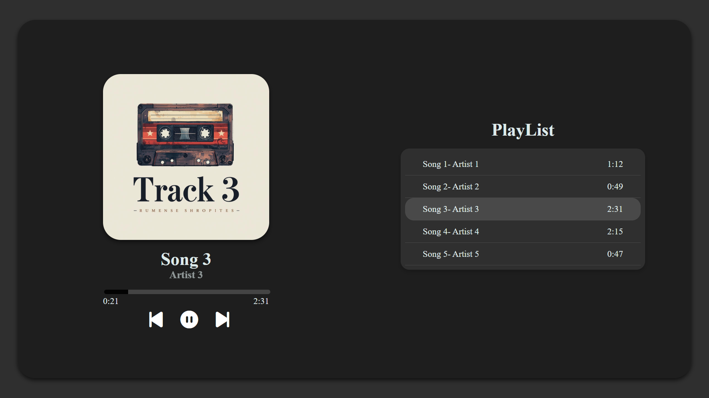
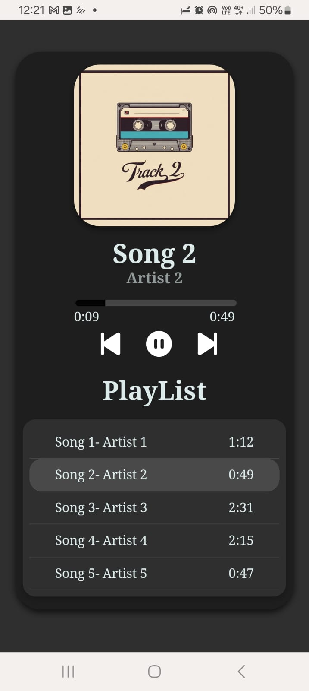

# 🎵 Audia Music Player  

✨ *Your music. Your vibes. Your Audia.* 🎶  

**Audia** is a sleek and responsive **web-based music player** built using **HTML, CSS, and JavaScript**.  
Developed as **Task 3** of my CodeAlpha Internship.  

**Live Demo:** [Try it here]( https://rutupatil27.github.io/Audia-music-player/)  
---

## 🚀 Features  
- ▶️ **Play / Pause** control  
- ⏭️ **Next / Previous** track navigation  
- 🎶 **Playlist support** – click any song to play it  
- 📊 **Progress bar** with seek functionality (jump forward/back)  
- ⏱️ **Timestamps** – current time and total duration  
- 🔄 **Auto-play** – next song plays automatically when the current one ends  
- 🎨 **Custom UI** with highlight for the currently playing song  
- 📱 **Responsive design** – works smoothly on desktop and mobile screens  

---

## 🛠️ Technologies Used
- **HTML5** – structure  
- **CSS3** – styling, animations & responsive layout  
- **JavaScript (ES6)** – player logic & DOM manipulation  
- **FontAwesome** – icons  

---

## 📸 Screenshots

| 🖥️ Desktop View | 📱 Mobile View |
|-----------------|----------------|
|  |  |
